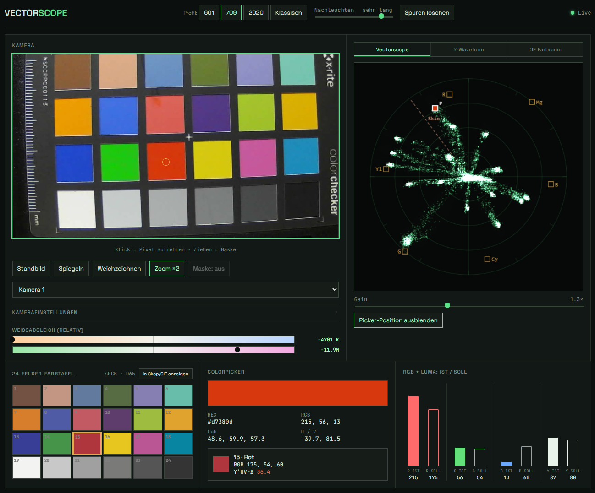
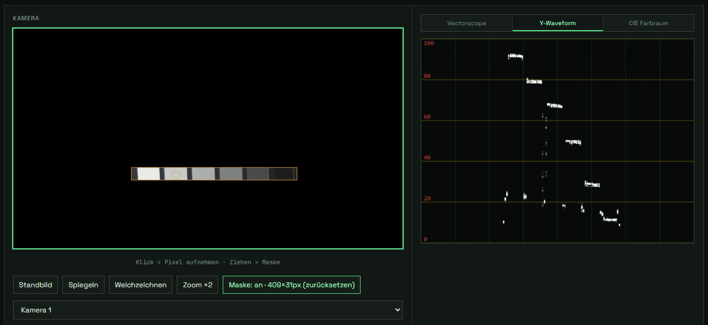
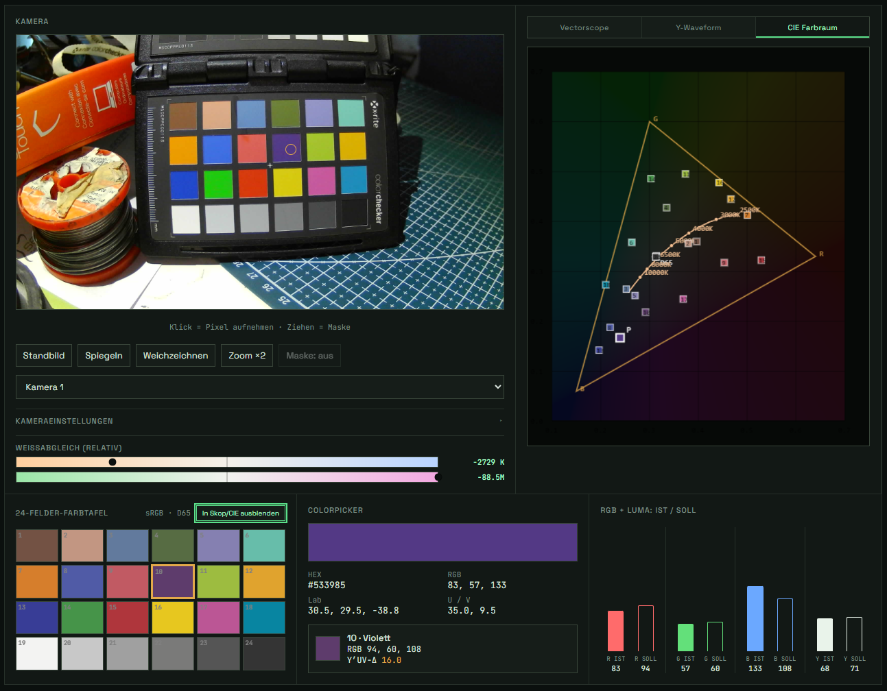

# Vectorscope

Ein einzelnes, selbstständiges HTML/JS/CSS-Tool, das das Live-Bild der Webcam als Vektorskop, Waveform-Monitor und CIE-Chromatizitätsdiagramm darstellt – plus Pixel-Colorpicker mit Abgleich gegen eine 24-Felder-Farbtafel. Läuft komplett im Browser, kein Server, kein Build-Schritt, keine externen Abhängigkeiten außer zwei Google-Fonts.

Aktueller Stand: **chmee v15.4** (Footer der App).

## Schnellstart

1. `vectorscope.html` im Browser öffnen (am besten Chrome/Edge – siehe [Browser-Kompatibilität](#browser-kompatibilität)).
2. Kamerazugriff erlauben.
3. Fertig – das Bild läuft live, alle Instrumente aktualisieren sich fortlaufend.

Kein Internetzugang nötig außer für den einmaligen Font-Ladevorgang; die App selbst braucht keine Serververbindung.

## Layout

- **Kopfzeile**: Titel, Farbprofil-Umschalter (601/709/2020/Klassisch), Nachleuchten-Regler, „Spuren löschen".
- **Obere Zeile, zweispaltig**: links das (größere) Kamerabild samt Bedienelementen und Weißabgleich-Leisten; rechts ein Tab-Panel mit Vektorskop, Y-Waveform und CIE-Farbraum.
- **Untere Zeile, dreispaltig**: 24-Felder-Farbtafel, Colorpicker, RGB+Luma-Diagramm (IST/SOLL). Alle drei Felder strecken sich auf die Höhe des Colorpicker-Panels.

## Funktionsübersicht

### Kamera-Panel (oben links)
- Live-Vorschau (16:9, intern 960×540), darunter **eine Reihe** mit allen Bild-Helfern: **Standbild**, **Spiegeln**, **Weichzeichnen** (Gauß-Blur zur räumlichen Rauschmittelung), **Zoom ×2** (digitaler Center-Crop-Zoom) und **Maske: aus/an** (Rechteck im Bild aufziehen maskiert den Rest schwarz und nimmt ihn aus der Analyse; der Button selbst zeigt den Status und setzt per Klick zurück – kein separates Statusfeld mehr).
- Darunter die Kameraauswahl bei mehreren Geräten.
- **„Kameraeinstellungen"** – ein standardmäßig **geschlossenes** Aufklapp-Feld (`
`), das sich dynamisch aus dem aufbaut, was Browser und Kamera über die `MediaTrackCapabilities`-API tatsächlich melden (Auflösung, Bildrate, Weißabgleich-Modus, Belichtung, Fokus, Hardware-Zoom, Helligkeit/Kontrast/Sättigung, Torch …). Nicht unterstützte Werte werden schlicht nicht angezeigt – in Chrome erscheinen meist deutlich mehr Regler als in anderen Browsern.
- **Weißabgleich-Leisten** – zwei kompakte, relative Anzeigen (siehe [Weißabgleich-Schätzung](#weißabgleich-schätzung)).

### Vectorscope / Y-Waveform / CIE Farbraum (oben rechts, als Tabs)
- **Vectorscope** – Y′UV-Chrominanzebene mit Zielmarken (R/G/B/C/M/Yl), Hauttonlinie und Gain-Regler.
- **Y-Waveform** – Helligkeitsverlauf über die Bildbreite, Skala **0–100**; alle 20 Einheiten eine gelbe Referenzlinie mit roter Zahl.
- **CIE Farbraum** – akkurat eingefärbter sRGB-Arbeitsbereich (x: 0.1–0.7 / y: 0–0.7), sRGB-Gamut-Dreieck, Planckscher Kurvenzug ab 2500K und D65-Weißpunkt.

Vektorskop und CIE-Diagramm können optional die 24 Farbtafel-Felder als Marker einblenden – der Button dafür sitzt bei der Farbtafel-Überschrift unten links und steuert beide Diagramme gemeinsam. Der Picker-Marker (aktuell gepickte Farbe) ist in beiden Diagrammen zuschaltbar/eingeblendet.

### Farbtafel / Colorpicker / RGB+Luma (unten)
- Klick ins Kamerabild pickt eine Farbe und **verfolgt die Bildposition live weiter** – der Wert wird jeden Frame neu abgetastet und über die letzten Samples gemittelt (siehe [Glättung](#glättung-der-messwerte)).
- Anzeige in HEX, RGB, Lab, U/V, automatischer Abgleich mit dem nächstliegenden der 24 Farbtafel-Felder.
- Balkendiagramm „IST / SOLL" für R, G, B und Luma (Y) – nutzt die volle verfügbare Panel-Höhe.

## Technische Details

### Y′UV-Farbprofile
Umschaltbar zwischen **Rec.601**, **Rec.709** (Standard), **Rec.2020** und einer **klassischen** analogen PAL/NTSC-Variante. Die Kamera liefert immer physisches sRGB – die Umschaltung ändert nur, mit welchen Luma-Koeffizienten (Kr/Kb) daraus Y′/U′/V′ berechnet wird. Für 601/709/2020 wird die normierte Pb/Pr-Form verwendet; „Klassisch" nutzt die historischen Konstanten 0.492/0.877.

### Farbfeld-Matching
Der „nächste" Farbtafel-Wert wird per euklidischem Abstand im Y′UV-Raum (Luma + Vektorskop-Ebene) zum aktuell gewählten Profil bestimmt, nicht per RGB oder Lab. Ändert sich das Profil, wird der aktuell gepickte Wert automatisch neu bewertet.

### Weißabgleich-Schätzung
1. Gepicktes RGB → CIE-xy-Chromatizität (sRGB/D65-XYZ-Matrix).
2. **Farbtemperatur (CCT):** McCamy-Näherung (1992) aus der xy-Chromatizität.
3. **Tint (Grün/Magenta):** **Duv** – senkrechter Abstand von der Planckschen Kurve im CIE-1960-uv-Raum (ANSI C78.377), positiv = Grün, negativ = Magenta. Entspricht dem „+3G"/„-2M"-Index mancher Lichtmessgeräte.

Beide Werte sind **nur bei annähernd achromatischen (grauen/weißen) Farben** aussagekräftig – berechnet wird trotzdem immer, die Einordnung liegt beim Nutzer.

Dargestellt werden sie **relativ** auf zwei symmetrischen Leisten:
- **Warm ↔ Kalt**, Referenz 6500K/D65 in der Mitte, Zahl als Kelvin-Differenz (z. B. „+320 K").
- **Grün ↔ Magenta**, Referenz Duv = 0 in der Mitte, Zahl als G/M-Index (z. B. „+2.1G").

Jede Leiste hat eine statische senkrechte Mittenlinie (Referenzpunkt) und einen dunklen Punkt-Marker direkt auf dem Farbverlauf (kein Zeiger darüber). Das CIE-Diagramm zeigt dagegen weiterhin Absolutwerte (2500K, 5000K, D65 …) an der Planck-Kurve selbst.

### Glättung der Messwerte
Colorpicker (HEX/RGB/Lab/U/V), die RGB+Luma-Balken, der Farbtafel-Match, die Vektorskop-/CIE-Picker-Marker und die Weißabgleich-/Tint-Werte laufen alle über einen gemeinsamen gleitenden Mittelwert der letzten Live-Samples (`PICKER_SMOOTHING_SAMPLES`). Ein Klick auf ein Farbtafel-Feld bleibt exakt (keine Mittelung) und setzt den Puffer zurück; ein neuer Klick ins Kamerabild setzt ihn ebenfalls zurück.

### Planckscher Kurvenzug
Näherung nach Kim et al. (2002), gezeichnet ab 2500K (darunter wird die Näherung sichtbar ungenau/geknickt und ist deshalb bewusst abgeschnitten).

### CIE-Diagramm-Einfärbung
Jeder Pixel im Diagramm wird über die inverse sRGB/D65-Matrix zurück nach sRGB gerechnet (bei Y=1). Farben außerhalb des sRGB-Gamuts werden verhältniserhaltend skaliert statt hart geclippt, damit der Übergang am Gamut-Rand weich bleibt.

## Einstellbare Variablen

Alle folgenden Werte sind als benannte Konstanten im `<script>`-Block kommentiert und lassen sich direkt anpassen:

| Variable | Standardwert | Wirkung |
|---|---|---|
| `PICKER_SMOOTHING_SAMPLES` | `5` | Fenstergröße der gleitenden Mittelung für Colorpicker + Weißabgleich/Tint |
| `CHROMA_COLOR_ALPHA` | `0.1` | Deckkraft der akkuraten Farbeinfärbung im CIE-Diagramm (0 = aus, 1 = voll deckend) |
| `CCT_REF` | `6504` | Referenztemperatur (D65) für die Warm/Kalt-Leiste und die relative K-Anzeige |
| `MAX_CCT_DEVIATION_MIRED` | `100` | Wie viel Mired-Abweichung von `CCT_REF` die Warm/Kalt-Leiste bis zum Rand ausschlägt |
| `MAX_DUV_DEVIATION` | `0.02` | Wie viel Duv-Abweichung die Grün/Magenta-Leiste bis zum Rand ausschlägt |
| `BLUR_PX` | `3` | Radius des Weichzeichnen-Effekts in Pixeln |
| `ZOOM_FACTOR` | `2` | Vergrößerungsfaktor des Center-Crop-Zooms |
| `SAMPLE_W` / `SAMPLE_H` | `160` / `90` | Auflösung der internen Sampling-Canvas für Vektorskop/Waveform (Performance vs. Detailgrad) |

Kleinere Deviation-Werte machen die Weißabgleich-Leisten empfindlicher (feiner aufgelöst), größere Werte toleranter. Ein größeres `PICKER_SMOOTHING_SAMPLES` macht alle Messwerte ruhiger, aber träger im Ansprechverhalten.

Die Balkenhöhen im RGB+Luma-Diagramm sowie die Größe der Farbtafel-Felder werden **nicht** über feste Konstanten, sondern zur Laufzeit aus der tatsächlich gerenderten Panel-Höhe berechnet (passen sich also automatisch an, z. B. bei Fenstergrößenänderung).

## Bekannte Einschränkungen

- **Farbtiefe pro Kanal** ist über Web-Kamera-APIs nicht abfragbar oder einstellbar – Browser liefern grundsätzlich 8-Bit pro Kanal an den Canvas, unabhängig davon, was der Sensor intern kann.
- **`MediaTrackCapabilities`** wird nicht von allen Browsern gleich gut unterstützt (Safari z. B. eingeschränkt) – die Kameraeinstellungen-Sektion zeigt dann entsprechend weniger oder gar keine Regler.
- Farbtafel-Referenzwerte sind gängige sRGB-Näherungen einer 24-Felder-Farbtafel, keine Herstellermessung.
- Das CIE-Diagramm ist ein vereinfachtes xy-Diagramm (sRGB-Dreieck + Planck-Kurve im Bereich x: 0.1–0.7 / y: 0–0.7), kein vollständiges CIE-1931-Hufeisen mit Spektrallinie.
- CCT/Duv-Schätzung ist eine Näherung (McCamy 1992 bzw. Kim et al. 2002) und nur bei annähernd neutralen Farben sinnvoll interpretierbar.

## Browser-Kompatibilität

Empfohlen: aktuelles **Chrome** oder **Edge** (beste Unterstützung für `getUserMedia`, `MediaTrackCapabilities`, Canvas-`filter`). Firefox funktioniert für die Kernfunktionen, meldet aber weniger Kamera-Fähigkeiten. Safari/iOS: Grundfunktionen laufen, die erweiterten Kameraeinstellungen bleiben meist leer.

## Dateien

- `vectorscope.html` – die komplette Anwendung, eine einzelne Datei
- `README.md` – dieses Dokument
